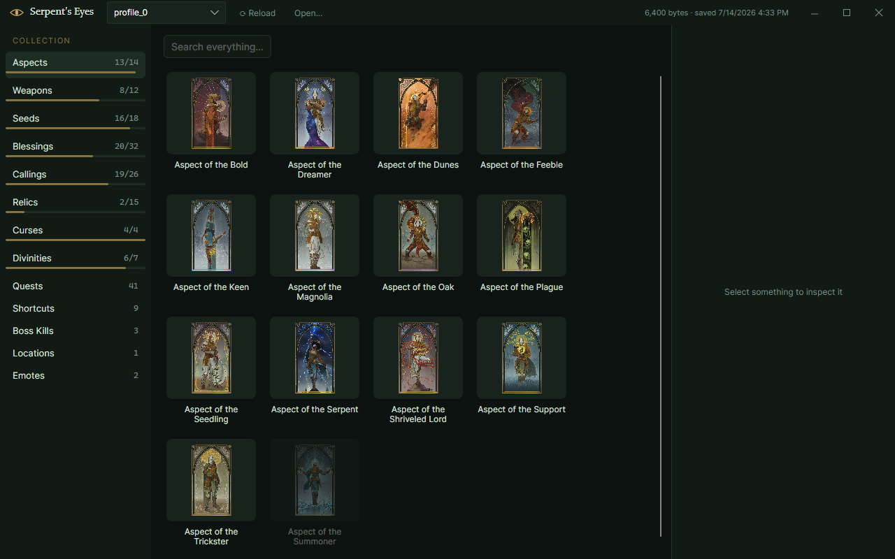

# Serpent's Eyes

A collection browser for **Serpent's Gaze** — see everything you've unlocked, and everything you haven't.

[](https://github.com/nooikko/serpents-eyes/actions/workflows/ci.yml)
[](https://github.com/nooikko/serpents-eyes/releases/latest)
[](https://github.com/nooikko/serpents-eyes/releases)
[](LICENSE)
[](https://github.com/nooikko/serpents-eyes/releases)

<p align="center">
  
</p>

Serpent's Eyes reads your save file and shows your progression as a card gallery using the
game's real art. It never writes to your saves.

## Features

- **Every category, with completion counts** — Aspects, Weapons (including Weapon Masteries),
  Seeds, Blessings, Callings, Relics, Curses, Quests, Shortcuts, Boss Kills, Locations, Emotes,
  and the seven Divinities.
- **Locked content is shown, not hidden.** Missing entries appear greyed with an unlock hint,
  so the gallery doubles as a checklist.
- **Counters translated into meaning.** "Obtained ×4" and "45 boss kills while blessed" instead
  of a bare integer.
- **Scaling formulas rendered readably.** `3+2*{l}` becomes `3 + (2 × Lv)` with the computed
  value at your level.
- **The run in progress** — current map, position, and equipped loadout.
- **Read-only by design.** The app opens saves with sharing enabled, so it works while the game
  is running, and never writes to them.

## Download

Grab the latest build from the [**Releases** page](https://github.com/nooikko/serpents-eyes/releases/latest),
unzip it anywhere, and run `SerpentsEyes.exe`. No installer and no .NET runtime required.

Serpent's Gaze is a Windows game, so the released build is Windows-only. The core library is
cross-platform and the app builds and runs on Linux and macOS from source — useful if you play
through Proton, since save discovery understands Wine prefixes.

### Build from source

Requires the [.NET 10 SDK](https://dotnet.microsoft.com/download).

```
git clone https://github.com/nooikko/serpents-eyes.git
cd serpents-eyes
dotnet run --project src/SerpentsEyes.App
```

For a self-contained executable:

```
dotnet publish src/SerpentsEyes.App -c Release -r win-x64
```

Release builds enable AOT by default. The output is `SerpentsEyes.exe` plus three native
rendering DLLs (Skia, HarfBuzz, ANGLE) — copy those four files together. The `.pdb` files are
optional debug symbols.

> **If the publish fails with `'vswhere.exe' is not recognized`**, the AOT toolchain shells out
> to `vswhere` to locate the MSVC linker and it isn't on your `PATH`. Add it:
>
> ```powershell
> $env:PATH = "C:\Program Files (x86)\Microsoft Visual Studio\Installer;$env:PATH"
> ```
>
> Running the publish from a **Developer PowerShell for VS 2022** does the same thing. To skip
> native AOT entirely, use `-p:PublishAot=false -p:SelfContained=true`.

## Usage

Serpent's Eyes finds your saves automatically in
`%LOCALAPPDATA%\SerpentsGaze\Saved\SaveGames\Steam` and opens `profile_0`. Use the dropdown in
the title bar to switch between profiles, autosaves, and backups.

If your saves are somewhere else — a relocated install, a copy from another machine, or a
Proton prefix — use **Open…** or drag a `.sav` file onto the window.

**Reload** re-reads the current file from disk. This works while Serpent's Gaze is running, so
you can alt-tab out, hit Reload, and see what a run just unlocked.

## Using the library

`SerpentsEyes.Core` is a zero-dependency, AOT-safe .NET library. It is the whole save format,
independent of the UI.

```csharp
using SerpentsEyes.Core;

var profile = SaveProfile.Load(path);              // or SaveProfile.Parse(bytes)

foreach (TagRecord r in profile.Records)           // "Progression.Class.WellRounded" = 1
    Console.WriteLine($"{r.Category}/{r.Name} = {r.Value}");

RunSnapshot run = profile.RunSnapshot;             // map, position, equipped loadout

profile.Find("Progression.Meta.Run.Started")!.Value = 43;   // records are mutable
byte[] bytes = profile.ToBytes();
profile.Save(path);                                // write-capable (back up first!)
```

`SaveLocator.FindProfiles()` locates save files across every plausible location on the current
platform, including Proton prefixes; `SaveLocator.DefaultSaveDirectory` is the plain Windows
path, useful for error messages.

### Round-trip guarantee

`SaveProfile.Parse(bytes).ToBytes()` reproduces its input **exactly**. Regions you don't modify
are copied back verbatim from the source buffer, so unknown fields, unusual string encodings,
and trailing padding all survive untouched — the parser does not have to understand a byte in
order to preserve it.

After an edit, only the changed region is re-encoded. Setting one record's `Value` changes
exactly those four bytes and nothing else, which is what makes save editing on top of this
library safe.

### Game data

```csharp
using SerpentsEyes.Core.GameData;

TagDatabase.Find("Progression.Blessing.ChanceHoT")?.DisplayName;   // "Daydreams"
TagDatabase.FindByInternalId("Tree_Warhammer")?.DisplayName;       // "Gatekeeper's Warhammer"
TagDatabase.MapTitle("Majin_HolyCity");                            // "Namah, City of Pilgrims"
```

Also in Core: `TagSemantics` (counter → Unlocked/InProgress/Locked plus human counter text),
`TagDatabase.Gods` (the seven Divinities with names, lore, statue prompts, and the in-game
blessing lock rules), `UeRichText.Parse` (the game's rich-text markup → typed segments), and
`ScalingMath.TryEvaluate` (`3+2*{l}` formulas).

A note on the game's own vocabulary, which the app follows: mushrooms are **Callings**,
utilities are **Relics**, and items are **Seeds**. Internal tag names often differ from display
names — tag `Curse.Jester` lives in asset `CA_BardBoy` and displays as "The Jester"; tag
`Curse.HordeCaller` is the "Dreamcallers" curse.

## Save format (`NG_SaveFormat_4`)

Reverse-engineered from real saves; this is not standard Unreal GVAS. All integers are
little-endian. Strings are FString-style: `int32 length` including a trailing NUL, then
single-byte characters and `\0`. A negative length means UTF-16LE with `-length` characters.

Single-byte payloads are decoded as Latin-1 rather than ASCII, because Latin-1 is a bijection
over all 256 byte values — an ASCII decoder silently replaces every byte ≥ 0x80 with `?`.

```
HEADER
  int32   unknown           observed 522
  int32   unknown           observed 1013
  int16×3 version triplet   observed 5, 5, 4
  byte[4] unknown           observed 52 3C 00 80
  fstring build id          "++NinjaGarden+live"
  byte    unknown           observed 0x03
  fstring format id         "/Script/NinjaGarden.NG_SaveFormat_4"

RECORDS
  int32   count
  count × { fstring tag; int32 value }
          tag   = "Progression.<Category>.<Name>"
          value = counter (1 = unlocked/done once, N = count, 0 = reached but not done)

TRAILER (current-run snapshot) — absent entirely in some saves
  int32   pending tag count  observed 0 or 1
  count × fstring            progression tags; see below
  fstring map name           "Majin_HolyCity", or "None" between runs
  double  X, Y, Z            player world position
  float   unknown            observed 73.0 (possibly health)
  pairs × { fstring slot type ("Item"); fstring id ("Class_Stronk", …) }
          until a zero/implausible length is read
  zero padding, then FF FF FF FF
```

Two details are easy to get wrong, and both were bugs here:

- **The trailer's first `int32` is a count, not an unknown.** It is `0` in any save taken
  between runs, which is most of them, so treating it as opaque appears to work. When it is
  non-zero, every field after it shifts by one string and the map name, position, and loadout
  all come out wrong. The strings it counts are progression tags — a save taken just after
  unlocking `Progression.Item.BasicCrit` lists exactly that tag.
- **`"None"` is Unreal's null `FName`**, not a map. Between runs the game writes the literal
  string rather than clearing the field, so a non-empty map name is not on its own evidence
  that a run is in progress.

## Regenerating the game data

`src/SerpentsEyes.Core/GameData/TagDatabase.g.cs` and the icons under
`src/SerpentsEyes.App/Assets/` are generated. **Do not edit them by hand.** You only need this
after a game update.

The game ships its assets inside UE5 IoStore containers (`NinjaGarden-Windows.utoc` / `.ucas`,
about 6.8 GB), which are Oodle-compressed. The extractor does not read those directly, so
step 1 is unpacking them with a third-party tool such as
[retoc](https://github.com/trumank/retoc).

> **This is not a quick step.** A full unpack is roughly 48,000 files and 12 GB on disk.

```
# 1. Unpack the game (third-party tool), producing .../NinjaGarden/Content
# 2. Regenerate the tag database and the icon manifest
dotnet run --project tools/SerpentsEyes.Extractor -- <path-to-Content>

# 3. Re-export the icons
dotnet run --project tools/SerpentsEyes.Extractor -- <path-to-Content> --icons
```

The content root can also come from the `SERPENTS_GAZE_CONTENT` environment variable. Reports
and the icon manifest go to `artifacts/` by default; override with `--out <dir>`. Run with
`--help` for everything, including `--probe` for dumping raw strings out of known assets.

The extractor parses the game's 18 StringTable assets plus ~140 item-definition assets and
emits the generated C# plus a JSON report. The `--icons` step decodes cooked UI textures
directly — inline `PF_B8G8R8A8` and DXT1/5 with `.ubulk` — so no `.usmap` is needed, then
downscales them to 384 px and encodes WebP. That is still more than twice the largest size
they are ever drawn at, and takes the icon set from 42.8 MB to 2.4 MB.

## Development

```
dotnet build
dotnet test
```

Requires .NET 10 (pinned in `global.json`). Warnings are errors in every project.

Test fixtures are frozen copies of real saves, so tests stay green while the game keeps writing
to the live save directory. `profile_pending_tags.sav` specifically covers a non-empty pending
tag list, which the other fixtures do not have.

Contributions are welcome — see [CONTRIBUTING.md](.github/CONTRIBUTING.md).

## Disclaimer

Serpent's Eyes is an unofficial, fan-made tool. It is not affiliated with, authorized by,
endorsed by, or in any way officially connected with the developers or publishers of Serpent's
Gaze. "Serpent's Gaze" and all related names, marks, artwork, and game content are the property
of their respective owners.

This tool reads save files that are already on your own computer. It does not modify,
circumvent, or redistribute the game itself.

If you are a rights holder and object to anything in this repository, please
[open an issue](https://github.com/nooikko/serpents-eyes/issues) and I will sort it out. If it's
urgent, say so in the title.

## Project status

Finished, as far as I'm concerned — it does what I built it to do, and I'm not actively adding
features.

It isn't abandoned, though. Bug reports and pull requests are genuinely welcome and I do read
them. I check GitHub about once a week, so please allow a few days for a reply.

## License

The source code is licensed under the [MIT License](LICENSE).

That license covers only the code. It does not cover the following, which are set out in full
in [NOTICE](NOTICE):

- **Game content.** In-game names, descriptions, lore, and the icons under
  `src/SerpentsEyes.App/Assets/Icons` are the property of the Serpent's Gaze rights holders and
  are reproduced here for interoperability. They are not licensed under the MIT License.
- **Wiki-derived text.** The curated unlock hints are adapted from the
  [Serpent's Gaze community wiki](https://serpents-gaze.fandom.com/) and are used under
  [CC BY-SA 3.0](https://creativecommons.org/licenses/by-sa/3.0/), which is share-alike and
  therefore not MIT-compatible.

## Acknowledgements

- The [Serpent's Gaze community wiki](https://serpents-gaze.fandom.com/), for unlock conditions
  that aren't recoverable from the game files.
- [Avalonia](https://avaloniaui.net/), for the UI framework.
- [retoc](https://github.com/trumank/retoc), for making the game's assets reachable at all.
